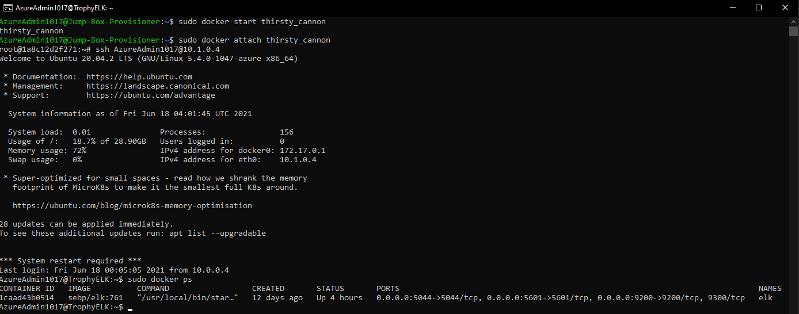

# Lucas Martynec UofM Cybersecurity Cohort-Project 1

## Automated ELK Stack Deployment

The files in this repository were used to configure the network depicted below.


These files have been tested and used to generate a live ELK deployment on Azure. They can be used to either recreate the entire deployment pictured above. Alternatively, select portions of the config and playbook files may be used to install only certain pieces of it, such as Filebeat or Metricbeat.

[My Ansible Configuration](Ansible/my_ansible_config.yml)

[Ansible Hosts File](Ansible/hosts)

[DVWA Playbook](Ansible/playbooks/dvwa_setup.yml)

[ELK Stack Playbook](Ansible/playbooks/install-elk.yml)

[Filebeat Playbook](Ansible/playbooks/filebeat-playbook.yml)

[Filebeat Configuration File Stored in /etc/ansible/roles](Ansible/roles/filebeat-config.yml)

[Metricbeat Playbook](Ansible/playbooks/metricbeat-playbook.yml)

[Metricbeat Configuration File Stored in /etc/ansible/files](Ansible/files/metricbeat-config.yml)

This document contains the following details:

- Description of the Topology
- Access Policies
- ELK Configuration
  - Beats in Use
  - Machines Being Monitored
- How to Use the Ansible Build


### Description of the Topology

The main purpose of this network is to expose a load-balanced and monitored instance of DVWA, the D*mn Vulnerable Web Application.

Load balancing ensures that the application will be highly available, in addition to restricting inbound access to the network. Using a load balancer like in this implementation will spread activity and traffic between all instances in it's backend pool. In this case, my load balancer, "AllGlassNoBreaks-LB" has my three Ubuntu VMs, Web-1, Web-2, and Web-3 in its backend pool. All three VMs are running DVWA and exist in the same Azure Availability Set: "NeverGonnaGiveYouUp" running a load balancer helps protect the Availability aspect of the CIA triad. The web traffic is locked down from my IP address to the load balancer via an Inbound Security Rule applied to the Azure Network Security Group "PayToPlay", the only other way to connect to the Web VMs is also locked down by an Inbound Security Rule that allows passwordless SSH using a public SSH key from the private IP of the "Jump-Box-Provisioner", 10.0.0.4 to the Virtual Network "MartyFlyZone", which includes the three Web VM's running DVWA. By utilizing a Jumpbox, we only allow access via a passwordless SSH public key locked down by a third Inbound Security Rule only allowing my IP address over port 22. Once connected to the Jumpbox, SSH is allowed to any of the other VMs in the Virtual Network. The "Jump-Box-Provisioner" as it's configured with applied inbound security rules creates a hardened network with minimal exposure to external threats.

Integrating an ELK server allows Admins to easily monitor the vulnerable DVWA VMs for changes to the file systems of all three VMs on the Network using Filebeat, as well as all system metrics such as CPU usage, attempted ssh logins, and memory usage using Metricbeat.

The configuration details of each machine may be found below.

| Name                   | Function   | Public IP Address | Private IP Address | Operating System                     |
|------------------------|------------|-------------------|--------------------|--------------------------------------|
| "Jump-Box-Provisioner" | Gateway    | 104.43.243.184    | 10.0.0.4           | Linux-Ubuntu Server 20.04 LTS - Gen1 |
| "Web-1"                | Web Server | None              | 10.0.0.5           | Linux-Ubuntu Server 20.04 LTS - Gen1 |
| "Web-2"                | Web Server | None              | 10.0.0.6           | Linux-Ubuntu Server 20.04 LTS - Gen1 |
| "Web-3"                | Web Server | None              | 10.0.0.7           | Linux-Ubuntu Server 20.04 LTS - Gen1 |
| "TrophyELK"            | Monitoring | 13.90.21.113      | 10.1.0.4           | Linux-Ubuntu Server 20.04 LTS - Gen1 |

### Access Policies

The machines on the internal network are not exposed to the public Internet. 

Only the "Jump-Box-Provisioner" machine can accept connections from the Internet. Access to this machine is only allowed from the following IP address on port 22:
-73.65.XXX.XX (My public IP)

Machines within the "MartyFlyZone" network can only be accessed by each other, except the "Jump-Box-Provisioner" which is able to be accessed via a passwordless SSH key. All three DVWA VMs send traffic to the ELK Server, "TrophyELK" by utilizing the Filebeat and Metricbeat data shippers across a peering connection between Virtual Networks "MartyFlyZone" and "ElkFlyZone". The "TrophyELK" server is accessible via web browser from my IP on port 5601, and from the Jumpbox via SSH on port 22.

A summary of the access policies in place can be found in the table below.

| Name                   | Publicly Accessible  | Allowed IP Addresses         |
|------------------------|----------------------|------------------------------|
| "Jump-Box-Provisioner" | Yes                  | 73.65.XXX.XX:22 via  SSH key |
| "Web-1"                | No                   | 10.0.0.1-254, 10.1.0.1-254   |
| "Web-2"                | No                   | 10.0.0.1-254, 10.1.0.1-254   |
| "Web-3"                | No                   | 10.0.0.1-254, 10.1.0.1-254   |
| "TrophyELK"            | Yes                  | 73.65.XXX.XX:5601            |

### Elk Configuration

Ansible was used to automate configuration of the ELK machine. No configuration was performed manually, which is advantageous because it lowers the chances of human error while greatly increasing the speed in which complex deployments can be spun up and torn down with a high degree of accuracy.

Running the [ELK Stack Playbook](Ansible/playbooks/install-elk.yml) from the Ansible container on the "Jump-Box-Provisioner" VM implements the following tasks:

- Configure Elk VM with Docker, installing Docker, Python3, Docker Python Module, and adjusting available memory.
- Download and launch an "elk" Docker Container that starts automatically.
- Ensure that Docker runs as a service on boot.

The following screenshot displays the result of running `docker ps` after successfully configuring the ELK instance.



### Target Machines & Beats

This ELK server is configured to monitor the following machines:

| Name                   | Function   | IP Address               | Operating System                     |
|------------------------|------------|--------------------------|--------------------------------------|
| "Web-1"                | Web Server | 10.0.0.5                 | Linux-Ubuntu Server 20.04 LTS - Gen1 |
| "Web-2"                | Web Server | 10.0.0.6                 | Linux-Ubuntu Server 20.04 LTS - Gen1 |
| "Web-3"                | Web Server | 10.0.0.7                 | Linux-Ubuntu Server 20.04 LTS - Gen1 |

We have installed the following Beats on these machines and collected Beat data on our Elk Server for Analysis:

- Filebeat

[Filebeat Playbook](Ansible/playbooks/filebeat-playbook.yml)

[Filebeat Config](Ansible/roles/filebeat-config.yml)

[Filebeat Data Success](Linux/Images/filebeat-module-status.png)

- Metricbeat

[Metricbeat Playbook](Ansible/playbooks/metricbeat-playbook.yml)

[Metricbeat Config](Ansible/files/metricbeat-config.yml)

[Metricbeat Data Success](Linux/Images/metricbeat-module-status.png)

These Beats allow us to collect Beats data to the ELK server, allowing Admins to easily monitor the vulnerable DVWA VMs for changes to the file systems (specifically Apache logs) of all three VMs on the Network using Filebeat. We will also log and chart: attempted ssh logins, all system metrics such as CPU usage, failed 'sudo' permissions, and memory usage using Metricbeat.

### Using the Playbook

In order to use the playbook, you will need to have an Ansible control node already configured, such as the "Jump-Box-Provisioner" in my deployment. Assuming you have such a control node provisioned you may proceed with the following instructions:

To use the playbooks, we must perform the following steps:

- Copy the entire contents of the [Ansible](Ansible) directory to /etc/ansible of the Ansible Control Node
- Run each playbook on the appropriate targets as designated by your /etc/ansible/hosts file

SSH into the Ansible control node and follow the steps below:

- Copy the entire [Ansible](Ansible) directory to /etc/ansible.

The easiest way to copy the playbooks is to use Git:

```bash
$ mkdir thanks_martyst
# Clone ELK-Stack-Project Repository and sub-directories/files
$ cd thanks_martyst
$ git clone https://github.com/martyst/ELK-Stack-Project.git
# Copy contents of /Ansible to `/etc/ansible` on the Ansible Control Node.
$ cp -r ELK-Stack-Project/Ansible/* /etc/ansible
```

That will move all playbook, configuration, and hosts files to the appropriate directories.

- Update the hosts file to include the webservers and elk servers IP's (assuming the ansible config is already properly setup)

```bash
$ cd /etc/ansible
$ nano hosts 

#edit ips of web and elk servers like below
[webservers]
ur.web.ip.1
ur.web.ip.2
ur.web.ip.3

[elk]
ur.elk.ip.X
#
```

- Once the git directory has been cloned, the hosts file, and ansible playbook are setup properly, run the following commands from the Ansible Control Node:

```bash
 $ cd /etc/ansible/playbooks
 $ ansible-playbook install-elk.yml 
 $ ansible-playbook filebeat-playbook.yml
 $ ansible-playbook metricbeat-playbook.yml 
 ```

To verify success, wait up to ten minutes to give ELK time to start up.

Then, run: `curl http://ur.elk.ip.X:5601`. This is the address of Kibana. If the installation succeeded, this command should print HTML to the console.
